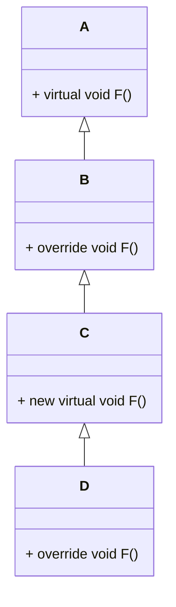

## C# 程序文件格式

### 1. `.cs` 文件

这是最常见的 C# 源文件格式，用于编写 C# 代码。每个 `.cs` 文件可以包含类、接口、结构体、枚举等类型的定义，也可以包含命名空间、方法、属性等成员的实现。

#### 用途

用于编写 C# 程序的源代码，是开发过程中主要的文件类型。

#### 示例结构

```csharp
// 引入命名空间
using System;

// 定义命名空间
namespace MyNamespace
{
    // 定义一个类
    public class MyClass
    {
        // 字段
        private int myField;

        // 构造函数
        public MyClass(int value)
        {
            myField = value;
        }

        // 方法
        public void MyMethod()
        {
            Console.WriteLine($"The value of myField is: {myField}");
        }
    }
}
```

### 2. `.csproj` 文件

这是 C# 项目文件，采用 XML 格式。它包含了项目的配置信息，如引用的程序集、编译选项、项目依赖等。

#### 用途

用于管理 C# 项目的构建和配置，在使用 Visual Studio 或者 `dotnet` 命令行工具进行项目管理时非常重要。

#### 示例结构

```xml
<Project Sdk="Microsoft.NET.Sdk">

  <PropertyGroup>
    <OutputType>Exe</OutputType>
    <TargetFramework>net6.0</TargetFramework>
    <Nullable>enable</Nullable>
    <ImplicitUsings>enable</ImplicitUsings>
  </PropertyGroup>

  <ItemGroup>
    <PackageReference Include="Newtonsoft.Json" Version="13.0.3" />
  </ItemGroup>

</Project>
```

在上述示例中：

-   `<PropertyGroup>` 标签内包含了项目的基本配置，如输出类型（`OutputType`）、目标框架（`TargetFramework`）等。
-   `<ItemGroup>` 标签内可以包含项目引用的 NuGet 包（`PackageReference`）等信息。

### 3. `.sln` 文件

这是 C# 解决方案文件，也是文本格式。解决方案是一个或多个项目的集合，`.sln` 文件用于组织和管理这些项目。

#### 用途

在大型项目开发中，通常会包含多个相关的项目，`.sln` 文件可以将这些项目组织在一起，方便开发人员进行统一管理和构建。

#### 示例结构

```plaintext
Microsoft Visual Studio Solution File, Format Version 12.00
# Visual Studio Version 17
VisualStudioVersion = 17.0.32803.293
MinimumVisualStudioVersion = 10.0.40219.1
Project("{FAE04EC0-301F-11D3-BF4B-00C04F79EFBC}") = "MyProject", "MyProject\MyProject.csproj", "{7F6669A3-4F43-4B3E-9F71-2787E5386854}"
EndProject
Global
    GlobalSection(SolutionConfigurationPlatforms) = preSolution
        Debug|Any CPU = Debug|Any CPU
        Release|Any CPU = Release|Any CPU
    EndGlobalSection
    GlobalSection(ProjectConfigurationPlatforms) = postSolution
        {7F6669A3-4F43-4B3E-9F71-2787E5386854}.Debug|Any CPU.ActiveCfg = Debug|Any CPU
        {7F6669A3-4F43-4B3E-9F71-2787E5386854}.Debug|Any CPU.Build.0 = Debug|Any CPU
        {7F6669A3-4F43-4B3E-9F71-2787E5386854}.Release|Any CPU.ActiveCfg = Release|Any CPU
        {7F6669A3-4F43-4B3E-9F71-2787E5386854}.Release|Any CPU.Build.0 = Release|Any CPU
    EndGlobalSection
    GlobalSection(SolutionProperties) = preSolution
        HideSolutionNode = FALSE
    EndGlobalSection
EndGlobal
```

这个文件定义了一个解决方案，包含一个项目 `MyProject`，同时还定义了解决方案的配置平台（如 `Debug|Any CPU` 和 `Release|Any CPU`）等信息。

### 4. `.resx` 文件

这是资源文件，采用 XML 格式。用于存储应用程序的资源，如字符串、图像、图标等。

#### 用途

方便进行多语言支持和资源管理，通过不同的 `.resx` 文件可以实现不同语言版本的资源切换。

#### 示例结构

```xml
<?xml version="1.0" encoding="utf-8"?>
<root>
  <xsd:schema id="root" xmlns="" xmlns:xsd="http://www.w3.org/2001/XMLSchema" xmlns:msdata="urn:schemas-microsoft-com:xml-msdata">
    <xsd:element name="root" msdata:IsDataSet="true">
      <xsd:complexType>
        <xsd:choice maxOccurs="unbounded">
          <xsd:element name="data">
            <xsd:complexType>
              <xsd:sequence>
                <xsd:element name="value" type="xsd:string" minOccurs="0" />
              </xsd:sequence>
              <xsd:attribute name="name" type="xsd:string" use="required" />
              <xsd:attribute name="type" type="xsd:string" />
              <xsd:attribute name="mimetype" type="xsd:string" />
            </xsd:complexType>
          </xsd:element>
        </xsd:choice>
      </xsd:complexType>
    </xsd:element>
  </xsd:schema>
  <data name="WelcomeMessage" xml:space="preserve">
    <value>Welcome to my application!</value>
  </data>
</root>
```

在这个示例中，`.resx` 文件存储了一个字符串资源 `WelcomeMessage`。


## C# 基本概念

### 编译过程

~~~mermaid
%%{init: {'theme':'dark'}}%%
%%{init: {"flowchart": {"htmlLabels": false}} }%%
%%{init: {"flowchart": {"defaultRenderer": "elk"}} }%%
flowchart LR
    A-->B
    B-->C
    C-->D
~~~


C# 程序由一个或多个文件组成。 每个文件均包含零个或多个命名空间。 一个命名空间包含类、结构、接口、枚举、委托等类型或其他命名空间。 以下示例是包含所有这些元素的 C# 程序主干。

~~~c#
using System;
namespace YourNamespace
{
    class YourClass
    {
    }

    struct YourStruct
    {
    }

    interface IYourInterface
    {
    }

    delegate int YourDelegate();

    enum YourEnum
    {
    }

    namespace YourNestedNamespace
    {
        struct YourStruct
        {
        }
    }

    class Program
    {
        static void Main(string[] args)
        {
            //Your program starts here...
            Console.WriteLine("Hello world!");
        }
    }
}
~~~

### 程序入口

`Main` 方法是 C# 应用程序的入口点。 `Main` 方法是应用程序启动后调用的第一个方法。

C# 程序中只能有一个入口点。 如果多个类包含 `Main` 方法，必须使用 StartupObject 编译器选项来编译程序，以指定将哪个 `Main` 方法用作入口点


### 签名

### 闭包

### 协变与逆变

## 类型系统

C# 是一种强类型语言。 每个变量和常量都有一个类型，每个求值的表达式也是如此。 每个方法声明都为每个输入参数和返回值指定名称、类型和种类（值、引用或输出）。 .NET 类库定义了内置数值类型和表示各种构造的复杂类型。 其中包括文件系统、网络连接、对象的集合和数组以及日期。 典型的 C# 程序使用类库中的类型，以及对程序问题域的专属概念进行建模的用户定义类型。

类型中可存储的信息包括以下项：

-   类型变量所需的存储空间。
-   可以表示的最大值和最小值。
-   包含的成员（方法、字段、事件等）。
-   继承自的基类型。
-   它实现的接口。
-   允许执行的运算种类。

编译器使用类型信息来确保在代码中执行的所有操作都是类型安全的。

如果声明 `int` 类型的变量，那么编译器允许在加法和减法运算中使用此变量。 如果尝试对 `bool`类型的变量执行这些相同操作，则会产生编译错误

~~~c#
using System.Diagnostics;

int a = 10;
int b = 20;
int c = a+ b;
Console.WriteLine(c);
// Console.WriteLine(c + true); // Error
~~~

**注：在 C# 中 bool 类型不能转换成数字**

### var关键字

当在程序中声明变量或常量时，必须指定其类型或使用 `var`关键字让编译器推断类型。

`var` 允许声明一个**局部变量**，而无需**显式指定其类型**。编译器会根据变量的初始化表达式**自动推断**其类型。一旦变量被初始化，其类型就被确定下来，并且后续不能再将其赋值为其他不兼容类型的值。

#### 使用规则

**必须初始化**：使用 `var` 声明变量时，必须同时进行初始化，因为编译器需要根据初始化表达式来推断变量的类型。

~~~C#
var a ; //erro 隐式类型化的变量必须已初始化
Console.WriteLine(a); 
~~~

**类型确定后不可更改**：一旦变量被初始化，其类型就被确定，后续不能将其赋值为不兼容类型的值。

~~~c#
var a = 114514;
string b = a; // Error 无法将类型“int”隐式转换为“string”
Console.WriteLine(b);
~~~

**只能用于局部变量**：`var` 只能用于声明局部变量，不能用于类的字段、方法参数、返回值等。

## 委托

**委托是一个类型，它定义了方法的类型，使得可以将方法当作另一个方法的参数来进行传递，这种将方法动态地赋给参数的做法，可以避免在程序中大量使用If-Else(Switch)语句，同时使得程序具有更好的可扩展性。**

委托是一种类型，表示对具有特定参数列表和返回类型的方法的引用。 实例化委托时，可以将委托实例与具有兼容签名和返回类型的任何方法相关联。 可以通过委托实例来调用（或执行）该方法。

类似封装的函数指针，主要用于回调函数的实现。

eg：

~~~c#
// 该委托可封装一个方法，该方法接收一个字符串作为参数，没有
public delegate void Callback(string message);
~~~


### 委托的使用


## 事件

事件使对象或类具备通知能力的**成员**，用于对象或类间的**动作协调**与**信息传递**

## 类

类是面向对象编程（[OOP](https://so.csdn.net/so/search?q=OOP&spm=1001.2101.3001.7020)）的核心概念之一，它允许用户定义自己的数据类型，并为这些数据类型指定属性和行为。类是一种引用类型，这意味着类实例（对象）存储在堆内存中，并通过引用进行访问

### 类的声明

使用 `class` 关键字，后跟一个唯一标识符（也就是类名）来声明类。

~~~c#
//[access modifier] - [class] - [identifier]
public class Customer
{
   // Fields, properties, methods and events go here...
}
~~~

可选访问修饰符（`access modifier`）位于 `class` 关键字前面。 `class` 类型的默认访问权限为 `internal`。

### 类的可访问性

#### 1. `public` 访问修饰符

`public` 表示访问不受限制，即该成员可以被任何代码访问，无论是在同一个程序集内还是不同的程序集。

```csharp
using System;

class PublicExample
{
    // 声明一个 public 字段
    public string PublicField = "这是一个 public 字段";

    // 声明一个 public 方法
    public void PublicMethod()
    {
        Console.WriteLine("这是一个 public 方法");
    }
}

class Program
{
    static void Main()
    {
        PublicExample example = new PublicExample();
        // 可以直接访问 public 字段
        Console.WriteLine(example.PublicField);
        // 可以直接调用 public 方法
        example.PublicMethod();
    }
}
```

#### 2. `protected` 访问修饰符

`protected` 表示访问范围限定于它所属的类或从该类派生的类型。也就是说，只有在类内部或者派生类中才能访问 `protected` 成员。

```csharp
using System;

class BaseClass
{
    // 声明一个 protected 字段
    protected string ProtectedField = "这是一个 protected 字段";

    // 声明一个 protected 方法
    protected void ProtectedMethod()
    {
        Console.WriteLine("这是一个 protected 方法");
    }
}

class DerivedClass : BaseClass
{
    public void AccessProtectedMembers()
    {
        // 在派生类中可以访问 protected 字段
        Console.WriteLine(ProtectedField);
        // 在派生类中可以调用 protected 方法
        ProtectedMethod();
    }
}

class Program
{
    static void Main()
    {
        DerivedClass derived = new DerivedClass();
        derived.AccessProtectedMembers();

        // 下面的代码会编译错误，因为在非派生类中不能直接访问 protected 成员
        // BaseClass baseObj = new BaseClass();
        // Console.WriteLine(baseObj.ProtectedField); 
        // baseObj.ProtectedMethod(); 
    }
}
```

#### 3. `internal` 访问修饰符

`internal` 表示访问范围限定于此程序（同一个程序集）。在同一个程序集中的任何代码都可以访问 `internal` 成员，但在不同的程序集中则不能访问。

```csharp
using System;

// 假设这是一个项目中的代码
internal class InternalExample
{
    // 声明一个 internal 字段
    internal string InternalField = "这是一个 internal 字段";

    // 声明一个 internal 方法
    internal void InternalMethod()
    {
        Console.WriteLine("这是一个 internal 方法");
    }
}

class Program
{
    static void Main()
    {
        InternalExample example = new InternalExample();
        // 在同一个程序集中可以访问 internal 字段
        Console.WriteLine(example.InternalField);
        // 在同一个程序集中可以调用 internal 方法
        example.InternalMethod();
    }
}
```

#### 4. `protected internal` 访问修饰符

`protected internal` 表示访问范围限定于此程序或那些由它所属的类派生的类型。也就是说，在同一个程序集中的任何代码，以及不同程序集中的派生类都可以访问 `protected internal` 成员。

```csharp
using System;

class BaseProtectedInternal
{
    // 声明一个 protected internal 字段
    protected internal string ProtectedInternalField = "这是一个 protected internal 字段";

    // 声明一个 protected internal 方法
    protected internal void ProtectedInternalMethod()
    {
        Console.WriteLine("这是一个 protected internal 方法");
    }
}

class DerivedProtectedInternal : BaseProtectedInternal
{
    public void AccessProtectedInternalMembers()
    {
        // 在派生类中可以访问 protected internal 字段
        Console.WriteLine(ProtectedInternalField);
        // 在派生类中可以调用 protected internal 方法
        ProtectedInternalMethod();
    }
}

class Program
{
    static void Main()
    {
        DerivedProtectedInternal derived = new DerivedProtectedInternal();
        derived.AccessProtectedInternalMembers();

        BaseProtectedInternal baseObj = new BaseProtectedInternal();
        // 在同一个程序集中可以访问 protected internal 字段
        Console.WriteLine(baseObj.ProtectedInternalField);
        // 在同一个程序集中可以调用 protected internal 方法
        baseObj.ProtectedInternalMethod();
    }
}
```

#### 5. `private` 访问修饰符

`private` 表示访问范围限定于它所属的类型。也就是说，只有在类内部才能访问 `private` 成员。

```csharp
using System;

class PrivateExample
{
    // 声明一个 private 字段
    private string PrivateField = "这是一个 private 字段";

    // 声明一个 private 方法
    private void PrivateMethod()
    {
        Console.WriteLine("这是一个 private 方法");
    }

    public void AccessPrivateMembers()
    {
        // 在类内部可以访问 private 字段
        Console.WriteLine(PrivateField);
        // 在类内部可以调用 private 方法
        PrivateMethod();
    }
}

class Program
{
    static void Main()
    {
        PrivateExample example = new PrivateExample();
        // 只能通过类的公共方法间接访问 private 成员
        example.AccessPrivateMembers();

        // 下面的代码会编译错误，因为在类外部不能直接访问 private 成员
        // Console.WriteLine(example.PrivateField); 
        // example.PrivateMethod(); 
    }
}
```

**注： 默认的已声明可访问性为 internal，类成员可具有五种已声明可访问性中的任何一种，默认为 private 。**

### 类的封装

#### 概念

封装是指将数据（属性）和操作这些数据的方法（行为）捆绑在一起，并隐藏对象的内部实现细节，只对外提供必要的访问接口。通过封装，对象的使用者不需要了解对象内部是如何实现的，只需要知道如何使用对象提供的接口即可。

#### 作用

-   **数据保护**：防止外部代码直接访问和修改对象的内部数据，避免数据被意外或恶意修改，从而保证数据的安全性和完整性。
-   **降低耦合度**：封装使得对象的内部实现细节对外部代码不可见，当对象的内部实现发生变化时，只要对外接口不变，就不会影响到使用该对象的其他代码，提高了代码的可维护性和可扩展性。
-   **提高代码的易用性**：对外提供简单、清晰的接口，让对象的使用者更容易理解和使用对象。

#### 实现方式

在 C# 中，主要通过访问修饰符（如 `private`、`protected`、`public` 等）来实现类的封装：

-   **`private`**：将类的成员（字段、方法等）声明为 `private`，表示这些成员只能在类的内部访问，外部代码无法直接访问。这是实现封装最常用的方式。
-   **属性（Property）**：属性是一种特殊的成员，它提供了对类的私有字段的间接访问。通过属性，可以对字段的访问进行控制，例如在属性的 `get` 和 `set` 访问器中添加验证逻辑。
-   **方法封装**：将一些复杂的操作封装在类的方法中，对外只暴露必要的方法接口，隐藏方法的具体实现细节。

~~~c#
using System;

// 定义一个 Person 类
class Person
{
    // 私有字段，用于存储姓名
    private string name;
    // 私有字段，用于存储年龄
    private int age;

    // 姓名属性，提供对 name 字段的访问
    public string Name
    {
        get { return name; }
        set
        {
            // 可以在这里添加验证逻辑
            if (!string.IsNullOrEmpty(value))
            {
                name = value;
            }
            else
            {
                Console.WriteLine("姓名不能为空。");
            }
        }
    }

    // 年龄属性，提供对 age 字段的访问
    public int Age
    {
        get { return age; }
        set
        {
            // 可以在这里添加验证逻辑
            if (value >= 0 && value <= 150)
            {
                age = value;
            }
            else
            {
                Console.WriteLine("年龄必须在 0 到 150 之间。");
            }
        }
    }

    // 方法封装，对外提供介绍信息的接口
    public void Introduce()
    {
        Console.WriteLine($"我叫 {name}，今年 {age} 岁。");
    }
}

class Program
{
    static void Main()
    {
        // 创建 Person 类的实例
        Person person = new Person();

        // 通过属性设置姓名和年龄
        person.Name = "张三";
        person.Age = 25;

        // 调用封装的方法
        person.Introduce();

        // 尝试设置无效的年龄
        person.Age = 200; 
    }
}
~~~

### 类的继承

一个类继承 (inherit) 它的直接基类类型的成员。继承意味着一个类隐式地将它的直接基类类型的**所有成员**当作自已的成员，但基类的实例**构造函数**、析构函数和**静态构造函数**除外。

#### 继承的性质

##### 1. 继承是可传递的

如果 `C` 从 `B` 派生，而 `B` 从 `A` 派生，则 `C` 将既继承在 `B` 中声明的成员，又继承在 `A` 中声明的成员。

```csharp
using System;

// 基类 A
class A
{
    public void MethodA()
    {
        Console.WriteLine("这是类 A 的方法");
    }
}

// 派生类 B，继承自 A
class B : A
{
    public void MethodB()
    {
        Console.WriteLine("这是类 B 的方法");
    }
}

// 派生类 C，继承自 B
class C : B
{
    public void MethodC()
    {
        Console.WriteLine("这是类 C 的方法");
    }
}

class Program
{
    static void Main()
    {
        C c = new C();
        // 可以调用类 A 的方法
        c.MethodA(); 
        // 可以调用类 B 的方法
        c.MethodB(); 
        // 可以调用类 C 自身的方法
        c.MethodC(); 
    }
}
```

在上述代码中，类 `C` 继承自类 `B`，类 `B` 继承自类 `A`，所以类 `C` 可以访问类 `A` 和类 `B` 中声明的方法。

##### 2. 派生类扩展它的直接基类

派生类能够在继承基类的基础上添加新的成员，但是它不能移除继承成员的定义。

```csharp
using System;

// 基类
class BaseClass
{
    public void BaseMethod()
    {
        Console.WriteLine("这是基类的方法");
    }
}

// 派生类
class DerivedClass : BaseClass
{
    // 添加新的成员
    public void NewMethod()
    {
        Console.WriteLine("这是派生类新增的方法");
    }
}

class Program
{
    static void Main()
    {
        DerivedClass derived = new DerivedClass();
        // 调用基类的方法
        derived.BaseMethod(); 
        // 调用派生类新增的方法
        derived.NewMethod(); 
    }
}
```

这里派生类 `DerivedClass` 继承了基类 `BaseClass` 的 `BaseMethod` 方法，同时添加了自己的 `NewMethod` 方法。

##### 3. 实例构造函数、析构函数和静态构造函数是不可继承的

所有其他成员是可继承的，无论它们所声明的可访问性如何。但是，根据它们所声明的可访问性，有些继承成员在派生类中可能是无法访问的。

```csharp
using System;

// 基类
class BaseClass
{
    private int privateField = 10;
    protected int protectedField = 20;
    public int publicField = 30;

    // 实例构造函数
    public BaseClass()
    {
        Console.WriteLine("基类的实例构造函数");
    }

    public void BaseMethod()
    {
        Console.WriteLine("这是基类的方法");
    }
}

// 派生类
class DerivedClass : BaseClass
{
    public DerivedClass()
    {
        Console.WriteLine("派生类的实例构造函数");
        // 可以访问 protected 成员
        Console.WriteLine(protectedField); 
        // 可以访问 public 成员
        Console.WriteLine(publicField); 
        // 不能访问 private 成员
        // Console.WriteLine(privateField); 
    }
}

class Program
{
    static void Main()
    {
        DerivedClass derived = new DerivedClass();
        derived.BaseMethod();
    }
}
```

在这个例子中，派生类 `DerivedClass` 不能继承基类 `BaseClass` 的构造函数，并且由于 `privateField` 是私有成员，派生类无法直接访问它。

##### 4. 派生类可以通过声明具有相同名称或签名的新成员来隐藏被继承的成员

但是，请注意隐藏继承成员并不移除该成员，它只是使被隐藏的成员在派生类中不可直接访问。

```csharp
using System;

// 基类
class BaseClass
{
    public void Method()
    {
        Console.WriteLine("基类的方法");
    }
}

// 派生类
class DerivedClass : BaseClass
{
    // 隐藏基类的方法
    public new void Method()
    {
        Console.WriteLine("派生类隐藏基类的方法");
    }
}

class Program
{
    static void Main()
    {
        DerivedClass derived = new DerivedClass();
        // 调用派生类隐藏后的方法
        derived.Method(); 

        BaseClass baseObj = derived;
        // 调用基类的方法
        baseObj.Method(); 
    }
}
```

在派生类 `DerivedClass` 中使用 `new` 关键字隐藏了基类 `BaseClass` 的 `Method` 方法。通过派生类对象调用 `Method` 时，调用的是派生类隐藏后的方法；**通过基类引用调用时，调用的是基类的方法**。

##### 5. 类的实例含有在该类中以及它的所有基类中声明的所有实例字段集

并且存在一个从派生类类型到它的任一基类类型的隐式转换。因此，可以将对某个派生类实例的引用视为对它的任一个基类实例的引用。

```csharp
using System;

// 基类
class BaseClass
{
    public int baseField = 10;
}

// 派生类
class DerivedClass : BaseClass
{
    public int derivedField = 20;
}

class Program
{
    static void Main()
    {
        DerivedClass derived = new DerivedClass();
        // 隐式转换为基类类型
        BaseClass baseObj = derived; 

        Console.WriteLine(baseObj.baseField);
        // 下面的代码会编译错误，因为基类引用无法访问派生类特有的字段
        // Console.WriteLine(baseObj.derivedField); 
    }
}
```

这里将 `DerivedClass` 类型的对象 `derived` 隐式转换为 `BaseClass` 类型的引用 `baseObj`，可以通过 `baseObj` 访问基类的字段，但无法访问派生类特有的字段。

##### 6. 类可以声明虚的方法、属性和索引器

而派生类可以重写这些函数成员的实现。这使类展示出 “多态性行为” 特征，也就是说，同一个函数成员调用所执行的操作可能是不同的，这取决于用来调用该函数成员的实例的运行时类型。

```csharp
using System;

// 基类
class Shape
{
    public virtual void Draw()
    {
        Console.WriteLine("绘制一个形状");
    }
}

// 派生类
class Circle : Shape
{
    public override void Draw()
    {
        Console.WriteLine("绘制一个圆形");
    }
}

class Rectangle : Shape
{
    public override void Draw()
    {
        Console.WriteLine("绘制一个矩形");
    }
}

class Program
{
    static void Main()
    {
        Shape[] shapes = new Shape[2];
        shapes[0] = new Circle();
        shapes[1] = new Rectangle();

        foreach (Shape shape in shapes)
        {
            // 根据实际对象类型调用不同的 Draw 方法
            shape.Draw(); 
        }
    }
}
```

在这个例子中，基类 `Shape` 的 `Draw` 方法被声明为 `virtual`，派生类 `Circle` 和 `Rectangle` 重写了该方法。通过基类数组存储不同派生类的对象，调用 `Draw` 方法时会根据对象的实际类型执行不同的操作，体现了多态性。

### 类的多态

在 C# 中，多态是面向对象编程的一个核心特性，它允许不同的对象对同一消息做出不同的响应。多态性可以提高代码的可扩展性和可维护性，使代码更加灵活和通用。

#### 方法重载

方法重载 (overloading) 允许**同一类中的多个方法具有相同名称**，条件是这些**方法具有唯一的签名**。在编译一个重载方法的调用时，编译器使用重载决策 (overload resolution) 确定要调用的特定方法。

在 C# 中，当存在方法重载（即同一个类中有多个同名但参数列表不同的方法）的情况时，编译器会通过**重载决策机制**来选择最优的方法进行调用。下面详细介绍重载决策的过程、规则以及相关示例。

重载决策是 C# 中的一种绑定时机制，其主要作用是在给定参数列表和一组候选函数成员的情况下，从这些候选成员中选择一个最佳的函数成员来执行调用。这一机制确保了在存在多个同名但参数列表不同的函数（如方法重载、构造函数重载、索引器重载、运算符重载）时，编译器能够准确地确定应该调用哪个具体的函数。

##### 重载决策的应用场景

###### 1. 方法调用

在调用 `invocation-expression` 中命名的方法时，会触发重载决策。例如：

```csharp
class Calculator
{
    public int Add(int a, int b)
    {
        return a + b;
    }

    public double Add(double a, double b)
    {
        return a + b;
    }
}

class Program
{
    static void Main()
    {
        Calculator calc = new Calculator();
        int result1 = calc.Add(1, 2);  // 调用 int Add(int a, int b)
        double result2 = calc.Add(1.5, 2.5);  // 调用 double Add(double a, double b)
    }
}
```

在这个例子中，`Calculator` 类中有两个名为 `Add` 的方法，编译器会根据调用时传递的参数类型来选择合适的方法。

###### 2. 实例构造函数调用

在 `object-creation-expression` 中调用命名的实例构造函数时，会进行重载决策。例如：

```csharp
class Person
{
    public Person()
    {
        Console.WriteLine("无参构造函数");
    }

    public Person(string name)
    {
        Console.WriteLine($"有参构造函数，姓名: {name}");
    }
}

class Program
{
    static void Main()
    {
        Person p1 = new Person();  // 调用无参构造函数
        Person p2 = new Person("Alice");  // 调用有参构造函数
    }
}
```

这里 `Person` 类有两个构造函数，编译器根据创建对象时传递的参数来选择合适的构造函数。

###### 3. 索引器访问器调用

通过 `element-access` 调用索引器访问器时，会使用重载决策。例如：

```csharp
class MyCollection
{
    private int[] data = new int[10];

    public int this[int index]
    {
        get { return data[index]; }
        set { data[index] = value; }
    }

    public int this[string key]
    {
        get { return 0; }
    }
}

class Program
{
    static void Main()
    {
        MyCollection collection = new MyCollection();
        collection[0] = 10;  // 调用 this[int index]
        int value = collection["test"];  // 调用 this[string key]
    }
}
```

`MyCollection` 类有两个索引器，编译器根据访问**索引器时传递的参数类型**选择合适的索引器访问器。

###### 4. 运算符调用

在调用表达式中引用预定义运算符或用户定义运算符时，也会进行重载决策。例如：

```csharp
class ComplexNumber
{
    public double Real { get; set; }
    public double Imaginary { get; set; }

    public static ComplexNumber operator +(ComplexNumber a, ComplexNumber b)
    {
        return new ComplexNumber { Real = a.Real + b.Real, Imaginary = a.Imaginary + b.Imaginary };
    }

    public static ComplexNumber operator +(ComplexNumber a, double b)
    {
        return new ComplexNumber { Real = a.Real + b, Imaginary = a.Imaginary };
    }
}

class Program
{
    static void Main()
    {
        ComplexNumber c1 = new ComplexNumber { Real = 1, Imaginary = 2 };
        ComplexNumber c2 = new ComplexNumber { Real = 3, Imaginary = 4 };
        ComplexNumber result1 = c1 + c2;  // 调用 operator +(ComplexNumber a, ComplexNumber b)

        ComplexNumber result2 = c1 + 5;  // 调用 operator +(ComplexNumber a, double b)
    }
}
```

`ComplexNumber` 类重载了 `+` 运算符，编译器根据运算符两侧的操作数类型选择合适的运算符重载。

##### 候选函数成员的确定

不同的上下文以自己的方式定义候选函数成员集和实参列表。例如，在方法调用中，候选集不包括标记为 `override` 的方法，并且如果派生类中有适用的方法，基类中的方法将不被视为候选方法。

##### 最佳函数成员的选择规则

###### 1. 适用的候选函数成员集

首先要确定适用的候选函数成员集，即那些可以接受给定实参列表的函数成员。如果这个集合中只有一个函数成员，那么它就是最佳函数成员。

###### 2. 匹配程度比较

如果适用的候选函数成员集包含多个成员，那么需要比较各成员对给定实参列表的匹配程度。

使用规则：将每个函数成员与其他所有函数成员进行比较，比其他所有函数成员匹配程度都高的那个函数成员就是最佳函数成员。

###### 3. 调用不明确错误

如果不是正好有一个函数成员比所有其他函数成员都好，那么函数成员调用不明确，会发生绑定时错误。例如：

```csharp
class Test
{
    public void Method(int a, double b) { }
    public void Method(double a, int b) { }
}

class Program
{
    static void Main()
    {
        Test test = new Test();
        // 下面的调用会产生编译错误，因为调用不明确
        // test.Method(1, 2); 
    }
}
```

在这个例子中，`Test` 类有两个 `Method` 方法，当调用 `test.Method(1, 2)` 时，编译器无法确定应该调用哪个方法，因为两个方法对实参的匹配程度相同，从而导致调用不明确的错误。

#### 虚方法

##### 定义

-   **非虚方法**：在方法声明中没有 `virtual` 修饰符的方法。其实现是固定的，无论通过声明该方法的类的实例调用，还是通过派生类的实例调用，调用的都是该方法**最初声明**的实现。
-   **虚方法**：在方法声明中使用 `virtual` 修饰符的方法。虚方法的实现可以由派生类通过 `override` 关键字进行重写，在**运行时**会**根据实例的实际类型来决定调用哪个实现**。

##### 示例分析1

```csharp
using System;
class A
{
    public void F() { Console.WriteLine("A.F"); }
    public virtual void G() { Console.WriteLine("A.G"); }
}
class B: A
{
    public void F() { Console.WriteLine("B.F"); }
    public override void G() { Console.WriteLine("B.G"); }
}
class Test
{
    static void Main() {
        B b = new B();
        A a = b;
        a.F();
        b.F();
        a.G();
        b.G();
    }
}
// A.F
// B.F
// B.G
// B.G
```

-   **类 `A`**：定义了一个非虚方法 `F` 和一个虚方法 `G`。
-   **类 `B`**：通过 `new` 关键字隐藏了基类 `A` 的非虚方法 `F`，并定义了自己的 `F` 方法；同时使用 `override` 关键字重写了基类 `A` 的虚方法 `G`。
-   `Main` 方法中
    -   `B b = new B();`：创建了 `B` 类的一个实例 `b`。
    -   `A a = b;`：将 `b` 赋值给 `A` 类型的变量 `a`，这里发生了隐式类型转换。
    -   `a.F();`：由于 `F` 是非虚方法，调用的是 `A` 类中声明的 `F` 方法，输出 `A.F`。
    -   `b.F();`：调用的是 `B` 类中隐藏 `A.F` 后新定义的 `F` 方法，输出 `B.F`。
    -   `a.G();`：`G` 是虚方法，运行时根据实例的实际类型 `B` 来决定调用的方法，因此调用的是 `B` 类中重写后的 `G` 方法，输出 `B.G`。
    -   `b.G();`：同样调用的是 `B` 类中重写后的 `G` 方法，输出 `B.G`。

##### 示例分析2




```csharp
using System;
class A
{
    public virtual void F() { Console.WriteLine("A.F"); }
}
class B: A
{
    public override void F() { Console.WriteLine("B.F"); }
}
class C: B
{
    new public virtual void F() { Console.WriteLine("C.F"); }
}
class D: C
{
    public override void F() { Console.WriteLine("D.F"); }
}
class Test
{
    static void Main() {
        D d = new D();
        A a = d;
        B b = d;
        C c = d;
        a.F();
        b.F();
        c.F();
        d.F();
    }
}
// B.F
// B.F
// D.F
// D.F
```

-   **类 `A`**：定义了一个虚方法 `F`。
-   **类 `B`**：重写了 `A` 类的虚方法 `F`。
-   **类 `C`**：使用 `new` 关键字隐藏了从 `A` 和 `B` 继承来的 `F` 方法，并定义了一个新的虚方法 `F`。
-   **类 `D`**：重写了 `C` 类新定义的虚方法 `F`。
-   `Main` 方法中
    -   `D d = new D();`：创建了 `D` 类的一个实例 `d`。
    -   `A a = d;`、`B b = d;`、`C c = d;`：分别将 `d` 赋值给 `A`、`B`、`C` 类型的变量，发生隐式类型转换。
    -   `a.F();`：`a` 的编译时类型是 `A`，运行时类型是 `D`，但由于 `A` 中的 `F` 方法被 `C` 隐藏，所以调用的是 `B` 类中重写的 `F` 方法，输出 `B.F`。
    -   `b.F();`：同理，调用的是 `B` 类中重写的 `F` 方法，输出 `B.F`。
    -   `c.F();`：`c` 的编译时类型是 `C`，运行时类型是 `D`，调用的是 `D` 类中重写的 `C` 类的 `F` 方法，输出 `D.F`。
    -   `d.F();`：直接调用 `D` 类中重写的 `F` 方法，输出 `D.F`。

##### 总结

-   非虚方法的调用由实例的编译时类型决定，而虚方法的调用由实例的运行时类型决定。
-   使用 `new` 关键字可以隐藏基类的方法，包括虚方法，隐藏后的方法不会影响虚方法调用时根据运行时类型选择实现的规则。
-   重写 `override` 关键字用于替换基类虚方法的实现，使虚方法在运行时能够根据实际对象类型调用不同的实现。

#### 重写方法

##### 定义

若一个实例方法声明中含有 `override` 修饰符，则称该方法为重写方法。重写方法的作用是**用相同的签名**重写所**继承的虚方法**，从而使现有的继承虚方法**专用化**，提供该方法的新实现。

##### 查找已重写基方法的规则

对于在类 `C` 中声明的重写方法 `M`，已重写的基方法是通过检查 `C` 的各个基类类型来确定的。从 `C` 的直接基类类型开始检查，然后依次检查每个后续的直接基类类型，直到在给定的基类类型中至少找到一个在用类型实参替换后与 `M` 具有相同签名的可访问方法。可访问方法包括 `public`、`protected`、`protected internal` 方法，或者是 `internal` 且与 `C` 声明在同一程序中的方法。

~~~mermaid
%%{init: {'theme':'dark'}}%%
graph TD;
    classDef startend fill:#F5EBFF,stroke:#BE8FED,stroke-width:2px;
    classDef process fill:#E5F6FF,stroke:#73A6FF,stroke-width:2px;
    
    A([开始]):::startend --> B(从类 C 的直接基类类型开始检查):::process;
    B --> C(检查是否找到与 M 签名相同的可访问方法):::process;
    C -->|是| D(找到已重写的基方法):::process;
    C -->|否| E(检查下一个直接基类类型):::process;
    E --> F(检查是否还有下一个直接基类类型):::process;
    F -->|是| B;
    F -->|否| G(未找到已重写的基方法，编译错误):::process;
    D --> H([结束]):::startend;
    G --> H;
~~~

##### 重写声明的编译时错误条件

1.  **能找到已重写的基方法**：必须按照上述规则找到一个已重写的基方法，否则会出现编译时错误。
2.  **只有一个重写的基方法**：在基类类型是构造类型时，用类型实参替换后只能有一个方法的签名与重写方法相同。
3.  **已重写的基方法特性**：已重写的基方法必须是**虚的、抽象或重写方法**，不能是静态或非虚方法。
4.  **已重写的基方法非密封**：已重写的基方法不能是密封方法。
5.  **相同的返回类型**：重写方法和已重写的基方法必须具有相同的返回类型。
6.  **相同的声明可访问性**：重写声明和已重写的基方法具有相同的声明可访问性，但如果已重写的基方法是 `protected internal`，并且声明它的程序集不是包含重写方法的程序集，则重写方法声明的可访问性必须是 `protected`。
7.  **继承约束**：重写声明不指定 `type-parameter-constraints-clauses`，而是从重写的基方法继承约束。

##### 重写与隐藏的区别

```csharp
class A
{
    public virtual void F() {}
}
class B: A
{
    public virtual void F() {}        // Warning, hiding inherited F()
}
```

在类 `B` 中，`F` 方法不包含 `override` 修饰符，因此不重写类 `A` 中的 `F` 方法，而是隐藏了它。由于声明中没有包含 `new` 修饰符，会报告一个警告。

##### 隐藏与重写的综合示例

```csharp
class A
{
    public virtual void F() {}
}
class B: A
{
    new private void F() {}           // Hides A.F within body of B
}
class C: B
{
    public override void F() {}       // Ok, overrides A.F
}
```

类 `B` 中的 `F` 方法将隐藏从类 `A` 中继承的虚 `F` 方法，且由于其具有私有访问权限，范围只包括 `B` 的类体。因此，类 `C` 中的 `F` 声明可以重写从类 `A` 继承的 `F` 方法。

通过合理使用重写方法，可以实现面向对象编程中的多态性，提高代码的可维护性和可扩展性。

## 抽象类

### 定义

抽象类是一种**不能被实例化的类**，它主要用于作为其他类的基类（父类），为派生类（子类）提供一个通用的模板或框架。抽象类通常包含一些抽象成员（如抽象方法、抽象属性等），这些抽象成员只有声明，没有具体的实现，需要派生类去实现。

### 抽象方法

#### 1. 修饰符与声明

在 C# 中，当实例方法声明包含 `abstract` 修饰符时，该方法就是抽象方法。抽象方法**隐含为虚方法**，但不能再使用 `virtual` 修饰符。其声明只引入新的虚方法，不提供具体实现，**方法体仅由一个分号组成**。例如：

```csharp
public abstract class Shape
{
    public abstract void Paint(Graphics g, Rectangle r);
}
```

这里 `Paint` 方法是抽象方法，`Shape` 类**必须是抽象类**，因为包含抽象方法。

#### 2. 实现要求

抽象方法要求非抽象的派生类必须重写该方法，以提供具体实现。如 `Ellipse` 和 `Box` 类继承自 `Shape` 类，它们是非抽象类，所以**必须重写** `Paint` 方法：

```csharp
public class Ellipse: Shape
{
    public override void Paint(Graphics g, Rectangle r) {
        // 假设这里有正确的绘制椭圆的代码
        // 示例代码中 g.DrawEllipse(r) 可能有误，正确的可能是 g.DrawEllipse(Pens.Black, r);
    }
}

public class Box: Shape
{
    public override void Paint(Graphics g, Rectangle r) {
        // 假设这里有正确的绘制矩形的代码
        // 示例代码中 g.DrawRect(r) 可能有误，正确的可能是 g.DrawRectangle(Pens.Black, r);
    }
}
```

#### 3. 所在类的限制

抽象方法**只能在抽象类**中声明。抽象类的存在是为了为派生类提供一个通用的接口或框架，抽象方法则是这个框架中需要派生类具体实现的部分。

### 特性

#### 1. 抽象类不能直接实例化

抽象类是不完整的，它的主要作用是作为基类为派生类提供一个通用的框架或接口。不能使用 `new` 运算符直接创建抽象类的实例，否则会导致编译时错误。不过，变量的编译时类型可以是抽象类，但该变量要么为 `null`，要么引用一个从该抽象类派生的非抽象类的实例。

使用 `abstract` 关键字来声明抽象类和抽象成员

```csharp
using System;

// 定义抽象类
abstract class Shape
{
    public abstract double Area();
}

class Circle : Shape
{
    private double radius;

    public Circle(double radius)
    {
        this.radius = radius;
    }

    public override double Area()
    {
        return Math.PI * radius * radius;
    }
}

class Program
{
    static void Main()
    {
        // 以下代码会编译错误，因为抽象类不能直接实例化
        // Shape shape = new Shape(); 

        // 可以定义抽象类类型的变量
        Shape circleShape; 

        // 变量可以为 null
        circleShape = null; 

        // 变量可以引用从抽象类派生的非抽象类的实例
        circleShape = new Circle(5); 
        Console.WriteLine("圆的面积: " + circleShape.Area());
    }
}
```

#### 2. 允许包含抽象成员

抽象类可以包含抽象成员（如抽象方法、抽象属性等），但不是必须的。抽象成员没有具体的实现，它们只是定义了一个接口，要求派生类必须实现这些成员。

```csharp
using System;

// 定义抽象类
abstract class Animal
{
    // 抽象方法
    public abstract void MakeSound(); 

    // 非抽象方法
    public void Eat()
    {
        Console.WriteLine("动物正在吃东西");
    }
}

class Dog : Animal
{
    public override void MakeSound()
    {
        Console.WriteLine("狗汪汪叫");
    }
}

class Program
{
    static void Main()
    {
        Animal dog = new Dog();
        dog.MakeSound();
        dog.Eat();
    }
}
```

#### 3. 抽象类不能被密封

密封类使用 `sealed` 关键字修饰，它不能被继承。而抽象类的目的就是作为基类被继承，所以抽象类不能被密封。如果尝试将抽象类声明为密封类，会导致编译错误。

```csharp
// 以下代码会编译错误，因为抽象类不能被密封
// abstract sealed class InvalidClass 
// {
//     public abstract void Method();
// }
```

### 从抽象类派生非抽象类

当从抽象类派生非抽象类时，非抽象类**必须具体实现所继承的所有抽象成员**，通过**重写**这些抽象成员来提供具体的实现。

```csharp
using System;

// 抽象类 A
abstract class A
{
    public abstract void F();
}

// 抽象类 B，继承自 A
abstract class B : A
{
    public void G()
    {
        Console.WriteLine("执行方法 G");
    }
}

// 非抽象类 C，继承自 B
class C : B
{
    public override void F()
    {
        Console.WriteLine("具体实现方法 F");
    }
}

class Program
{
    static void Main()
    {
        C c = new C();
        c.F();
        c.G();
    }
}
```

在上述示例中，抽象类 `A` 定义了抽象方法 `F`，抽象类 `B` 继承自 `A` 但没有实现 `F`，所以 `B` 也必须声明为抽象类。非抽象类 `C` 继承自 `B`，并实现了 `F` 方法，因此 `C` 可以被实例化。

### 抽象方法与虚方法比较

-   **虚方法**：在实例方法声明中使用 `virtual` 修饰符来定义。虚方法可以有具体的实现代码，其方法体包含实际的执行逻辑。

```csharp
class A
{
    public virtual void G() 
    {
        Console.WriteLine("A.G"); 
    }
}
```

-   **抽象方法**：使用 `abstract` 修饰符声明，并且只能在抽象类中使用。抽象方法不提供具体的实现，其方法体仅由一个分号组成。

```csharp
public abstract class Shape
{
    public abstract void Paint(Graphics g, Rectangle r);
}
```

#### 实现要求

-   **虚方法**：基类中的虚方法可以有默认的实现，派生类可以选择是否重写该方法。如果派生类不重写，将使用基类的默认实现。

```csharp
class B : A
{
    // 可以选择不重写 G 方法
    // 如果不重写，调用 B 实例的 G 方法时将执行 A.G 的实现
    public override void G() 
    {
        Console.WriteLine("B.G"); 
    }
}
```

-   **抽象方法**：抽象方法在抽象类中没有实现，非抽象的派生类必须重写抽象方法并提供具体的实现。

```csharp
public class Ellipse : Shape
{
    public override void Paint(Graphics g, Rectangle r) 
    {
        g.DrawEllipse(r);
    }
}
```

#### 修饰符使用

-   **虚方法**：使用 `virtual` 修饰符来表明该方法可以在派生类中被重写。

```csharp
public virtual void Method() { }
```

-   **抽象方法**：使用 `abstract` 修饰符，并且抽象方法隐含为虚方法，但不能再使用 `virtual` 修饰符。

```csharp
public abstract void Method();
```

#### 调用机制

-   **虚方法**：在虚方法调用中，调用所涉及的实例的运行时类型确定要调用的方法实现。即使通过基类类型的引用调用虚方法，实际执行的也是实例运行时类型中重写的方法（如果有重写）。

```csharp
B b = new B();
A a = b;
a.G(); // 输出 "B.G"，因为运行时类型是 B
```

-   **抽象方法**：由于抽象方法没有具体实现，不能直接调用。必须通过派生类中重写的具体实现来调用。

#### 类的限制

-   **虚方法**：可以在普通类中声明和使用，普通类可以实例化。

```csharp
class NormalClass
{
    public virtual void NormalVirtualMethod() { }
}
```

-   **抽象方法**：只能在抽象类中声明，抽象类不能实例化，主要用于作为基类为派生类提供统一的接口和规范。

```csharp
abstract class AbstractClass
{
    public abstract void AbstractMethod();
}
```

#### 重写规则

-   **虚方法**：派生类使用 `override` 关键字重写虚方法时，重写方法的访问修饰符、返回类型和参数列表必须与基类的虚方法一致。

```csharp
class BaseClass
{
    public virtual int VirtualMethod(int num) { return num; }
}
class DerivedClass : BaseClass
{
    public override int VirtualMethod(int num) { return num * 2; }
}
```

-   **抽象方法**：非抽象派生类必须使用 `override` 关键字重写抽象方法，同样要保证访问修饰符、返回类型和参数列表与抽象方法一致。

```csharp
abstract class AbstractBase
{
    public abstract int AbstractMethod(int num);
}
class ConcreteDerived : AbstractBase
{
    public override int AbstractMethod(int num) { return num + 1; }
}
```

## 接口

~~~Mermaid
%%{init: {'theme':'dark'}}%%
classDiagram
direction BT
	class Driver {
        - car:Car
        + Drive()
    }
    
    class Trucker {
        - truck:Truck
        + Drive()
    }
    
    class Racer {
        - raceCar: RaceCar
        + Drive()
    }
   	class Car {
        + Run()
    }
    
    class Truck {
        + Run()
    }
    
    class RaceCar {
        + Run()
    }
	Driver  ..> Car    
	Trucker ..> Truck
	Racer   ..> RaceCar
~~~

~~~mermaid
%%{init: {'theme':'dark'}}%%
classDiagram
direction BT
    class Driver {
        - car:Car
        + Drive()
    }
    class Car {
        + Run()
    }
    class Truck {
        + Run()
    }
    class IVehicle
    <<interface>> IVehicle
    IVehicle : + Run()
    Car ..|> IVehicle
    Truck ..|> IVehicle
    Driver ..> IVehicle
~~~

~~~mermaid
%%{init: {'theme':'dark'}}%%
classDiagram
direction BT
    class Driver {
        - vehicle : IVehicle
        + Drive()
    }
    class AiDriver{
    	- vehicle : IVehicle
    	+ Drive()
    }
    class Car {
        + Run()
    }
    class Truck {
        + Run()
    }
    class IVehicle{
    	<<interface>> 
    	+ Run()
    }
    class IDriver{
     	<<interface>>
    	- vehicle : IVehicle
    	+ Driver
    }
    
    Car 	..|> IVehicle
    Truck 	..|> IVehicle
    Driver 	..|> IDriver
    AiDriver..|> IDriver
    IDriver ..>  IVehicle
~~~

### 定义

一个接口定义一个协定。实现某接口的类或结构必须遵守该接口定义的协定。一个接口可以从多个基接口继承，而一个类或结构可以实现多个接口。

接口可以包含方法、属性、事件和索引器。接口本身不提供它所定义的成员的实现。接口只指定实现该接口的类或结构必须提供的成员。

### 接口声明

~~~c#
interface-declaration:
attributesopt   interface-modifiersopt   partialopt   interface   
		identifier   variant-type-parameter-listopt   interface-baseopt
		type-parameter-constraints-clausesopt   interface-body   ;opt
~~~

*interface-declaration* 可以根据需要包含一个接口修饰符序列：

~~~c#
interface-modifiers:
interface-modifier
interface-modifiers   interface-modifier
interface-modifier:
new
public
protected
internal
private
~~~

同一修饰符在一个接口**声明中多次出现**属于编译时**错误**。

~~~c#
// 常用接口声明
[访问修饰符] interface 接口名 [: 基接口1,...] [{接口体};]
~~~

访问修饰符： *public* *internel* *private* *protected* *new* 类似于类的访问修饰符用法

接口名：接口名是用于唯一标识接口的名称，遵循 C# 的命名规范，通常采用 Pascal 命名法，并且以字母 `I` 开头，这样能清晰表明它是一个接口。

接口继承：一个接口可以**继承多个基接口，多个基接口之间用逗号分隔**。继承基接口后，当前接口会包含基接口的所有成员，实现当前接口的类或结构体需要实现**所有继承的成员**。

接口体：接口体包含了接口的成员声明，如方法、属性、事件和索引器等。接口成员只有声明，没有实现体，**实现接口的类或结构体需要为这些成员提供具体实现**。接口体后面的分号是可选的。

### 接口隔离原则

接口隔离原则（Interface Segregation Principle，ISP）是面向对象设计的 SOLID 原则之一，由罗伯特・C・马丁（Robert C. Martin）提出。该原则的核心思想是：客户端不应该依赖它不需要的接口，一个类对另一个类的依赖应该建立在最小的接口上。也就是说，要将庞大、臃肿的接口拆分成更小、更具体的接口，让客户端只依赖它们实际需要的接口方法。

### 接口与抽象类


| 比较项   | 接口                       | 抽象类                                 |
| -------- | -------------------------- | -------------------------------------- |
| 多继承   | 支持                       | 不支持                                 |
| 类型限制 | 没有                       | 有，只能是引用类型                     |
| 方法实现 | 继承类型中必须给出方法实现 | 继承类中可以不给出（但需实现抽象方法） |
| 扩展性   | 比较麻烦                   | 相对比较灵活                           |
| 多层继承 | 比较麻烦，需要借助虚函数   | 比较灵活                               |


#### 1. 多继承

-   **接口**：支持多继承，一个接口可以继承多个基接口。这是因为接口仅定义方法签名，不包含具体实现，多个基接口的方法签名组合不会产生实现冲突。例如：

```csharp
interface IBase1
{
    void Method1();
}

interface IBase2
{
    void Method2();
}

interface IMultiInheritance : IBase1, IBase2
{
    // 继承了 Method1 和 Method2
}
```

-   **抽象类**：不支持多继承，一个类只能继承一个抽象类。这是因为抽象类可以包含具体的实现代码，如果支持多继承，可能会出现多个基类中方法实现冲突的问题。例如，若一个类同时继承两个抽象类，而这两个抽象类有同名方法且都有具体实现，就无法确定使用哪个实现。

#### 2. 类型限制

-   **接口**：没有类型限制，实现接口的可以是类、结构体等。结构体是值类型，类是引用类型，这意味着接口可以被更广泛的类型实现，增加了代码的灵活性。例如：

```csharp
interface IPrintable
{
    void Print();
}

struct PrintableStruct : IPrintable
{
    public void Print()
    {
        Console.WriteLine("Printing from struct...");
    }
}

class PrintableClass : IPrintable
{
    public void Print()
    {
        Console.WriteLine("Printing from class...");
    }
}
```

-   **抽象类**：只能被引用类型（即类）继承，因为抽象类本身是类，而 C# 中值类型（如结构体）不能继承类。

#### 3. 方法实现

-   **接口**：实现接口的类型必须为接口的所有方法提供具体实现。接口定义了一种契约，实现者必须遵守这个契约。例如：

```csharp
interface ICalculable
{
    int Add(int a, int b);
}

class Calculator : ICalculable
{
    public int Add(int a, int b)
    {
        return a + b;
    }
}
```

-   **抽象类**：继承抽象类的子类可以不实现抽象类中的**非抽象方法**，但必须实现抽象方法。抽象类可以包含一些通用的实现代码，子类可以复用这些代码，同时实现特定的抽象方法。例如：

```csharp
abstract class Shape
{
    public abstract double Area();

    public void Draw()
    {
        Console.WriteLine("Drawing a shape...");
    }
}

class Circle : Shape
{
    private double radius;

    public Circle(double radius)
    {
        this.radius = radius;
    }

    public override double Area()
    {
        return Math.PI * radius * radius;
    }
}
```

#### 4. 扩展性

-   **接口**：接口的扩展性相对麻烦。当需要在接口中添加新方法时，所有实现该接口的类型都必须添加相应的实现。例如，如果在 `ICalculable` 接口中添加一个新方法 `Subtract`，那么所有实现 `ICalculable` 接口的类都需要实现 `Subtract` 方法。
-   **抽象类**：扩展性相对灵活。可以在抽象类中添加非抽象方法，而不需要修改所有子类。子类可以直接使用这些新添加的方法。例如，在 `Shape` 抽象类中添加一个新的非抽象方法 `DisplayInfo`，所有子类都可以直接使用这个方法，无需修改子类代码。

#### 5. 多层继承

-   **接口**：多层继承相对麻烦，尤其是在需要实现复杂逻辑时，可能需要借助虚函数（不过接口本身没有虚函数的概念，这里可以通过其他方式模拟）。当接口多层继承时，实现类需要处理多个接口的方法，代码复杂度会增加。
-   **抽象类**：多层继承比较灵活。抽象类可以通过抽象方法和虚方法来实现多态，子类可以根据需要重写这些方法。在多层继承中，子类可以逐步扩展和修改基类的行为，代码结构更加清晰。例如，`Shape` 抽象类可以有子类 `Circle`，`Circle` 又可以有子类 `ColoredCircle`，它们可以逐步扩展和修改父类的行为。

#### 适用场景

-   **接口**：适用于需要不同类型的对象具有相同行为的场景，以及需要实现多继承效果的场景。例如，不同类型的交通工具（汽车、飞机、轮船）都可以实现一个 `IMovable` 接口。
-   **抽象类**：适用于一组相关的类具有一些共同的行为和属性的场景，以及需要在基类中提供一些通用实现代码的场景。例如，不同种类的动物（猫、狗、鸟）可以继承自一个抽象的 `Animal` 类。

## 反射

C#编程语言中，最常使用的是类和类中的函数和属性。正向调用的方法是，创建类，然后用类创建一个对象。接下来就可以用这个对象调用类中的方法和属性了。

而反射，就是相对于这种正向调用的存在。即，它是反向调用。

反射可以通过类名的字符串来创建类，可以通过函数名的字符串和属性名的字符串，来调用类下的函数和属性。

### 定义

反射是.NET框架提供的一个功能强大的机制，它允许程序在运行时检查和操作对象的类型信息。通过使用反射，程序可以动态地创建对象、调用方法、访问字段和属性，无需在编译时显式知道类型信息。在.NET中，所有类型的信息最终都是存储在元数据中的。反射就是.NET提供的一组API，允许在运行时访问这些元数据，从而获得关于程序集、模块、类型、成员等的详细信息。

### 程序集 Assembly、模块 Model、类型 Type

程序集是 .NET 应用程序的部署、版本控制、重用、激活范围和安全权限的基本单元。它可以是**可执行文件**（`.exe`），也可以是**类库文件**（`.dll`）。

模块是程序集的组成部分，一个程序集可以包含一个或多个模块。模块是中间语言代码的逻辑分组，它将相关的类型和资源组织在一起。

类型是对数据和行为的抽象描述，它定义了数据的结构和可以对数据执行的操作。在 .NET 中，类型是一个广泛的概念，包括类、接口、结构体、枚举、委托等。

~~~mermaid
%%{init: {'theme':'dark'}}%%
graph TD
    A(程序集 Assembly):::root --> B(模块 Model):::node
    A --> C(模块 Model):::node
    B --> D(类型 Type):::node
    B --> E(类型 Type):::node
    C --> F(类型 Type):::node
    C --> G(类型 Type):::node
~~~

### 实现


## 文件操作

在 C# 里，可以借助 `System.IO` 命名空间下的类来对文件和文件夹进行操作。

~~~c#

~~~


## linq

LINQ（Language Integrated Query，语言集成查询）是 C# 中一项强大的特性，它允许在 C# 代码中直接使用类似 SQL 的查询表达式，将查询功能集成到编程语言中。它通过提供标准的查询操作符和扩展方法，使得对不同数据源的查询变得更加简单和一致。

### 查询表达式

查询是一种从数据源检索数据的表达式。 不同的数据源具有不同的原生查询语言，例如，用于关系数据库的 SQL 和用于 XML 的 XQuery。LINQ 通过为各种数据源和数据格式提供一致的 C# 语言模型简化了查询。

#### 查询操作的组成

所有 LINQ 查询操作都由以下三个不同的操作组成：

1.  获取数据源。
2.  创建查询。
3.  执行查询。

~~~c#
var list = new List<int>() { 1, 2, 3, 4, 5 };
var res =
    from n in list
    where n % 2 == 0
    orderby n
    select n * 2;
foreach (var item in res)
{
    Console.WriteLine(item);
}
~~~

## 异常处理
